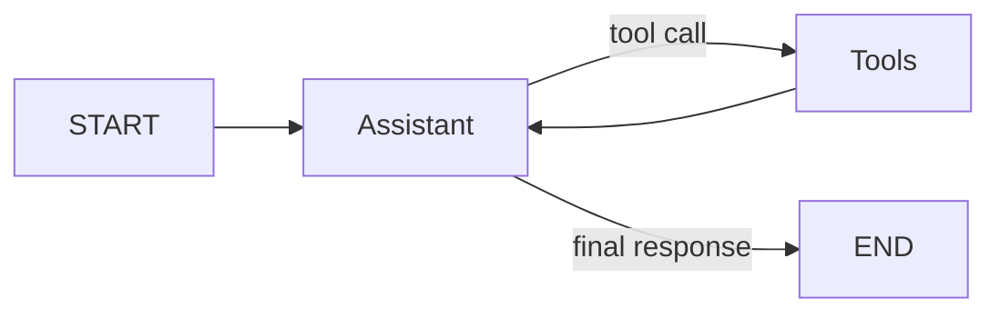

# Architecture and Design Decisions

## User journeys

### Structured form

1. User selects an HCP.
2. User records interaction details.
3. Redux stores the in-progress form.
4. The frontend sends the validated payload to FastAPI.
5. FastAPI uses the shared interaction service to persist it.

### Conversational assistant

1. User describes the requested action in natural language.
2. FastAPI sends the message to a LangGraph `StateGraph`.
3. The Groq model decides whether a tool is required.
4. The tool node executes one or more CRM tools.
5. Tool output returns to the model.
6. The model gives the user a concise confirmation or asks for missing data.

## LangGraph flow

The graph is explicit rather than hidden behind a higher-level agent helper. This makes the orchestration easy to explain during the technical walkthrough.

## Agent tools

### 1. search_hcp

Searches by HCP name, specialty, organization, or city. It prevents the assistant from attaching interactions to the wrong person.

### 2. log_interaction

Creates an interaction from extracted conversational fields. The LLM converts natural language into structured arguments. The service validates the HCP and saves the record.

### 3. edit_interaction

Updates selected fields on an existing interaction while preserving unspecified fields.

### 4. add_product_sample

Attaches a product sample distribution record to an interaction, including quantity and optional lot number.

### 5. schedule_follow_up

Creates a due-dated follow-up action associated with an interaction.

### 6. get_interaction_history

Returns recent HCP interactions so a field representative can prepare for the next visit.

## Data model

- `hcps`: HCP profile and organization data
- `interactions`: meeting details, summary, sentiment, outcome, and next step
- `sample_distributions`: product sample details linked to an interaction
- `follow_ups`: future actions linked to an interaction

## Production considerations

A production life-sciences CRM should add authentication, RBAC, field-level audit history, encryption, secrets management, consent controls, data retention, monitoring, and validation appropriate to the organization's regulatory scope.
